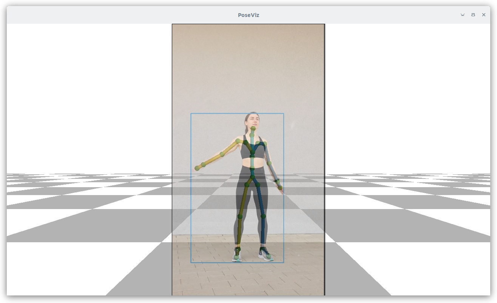
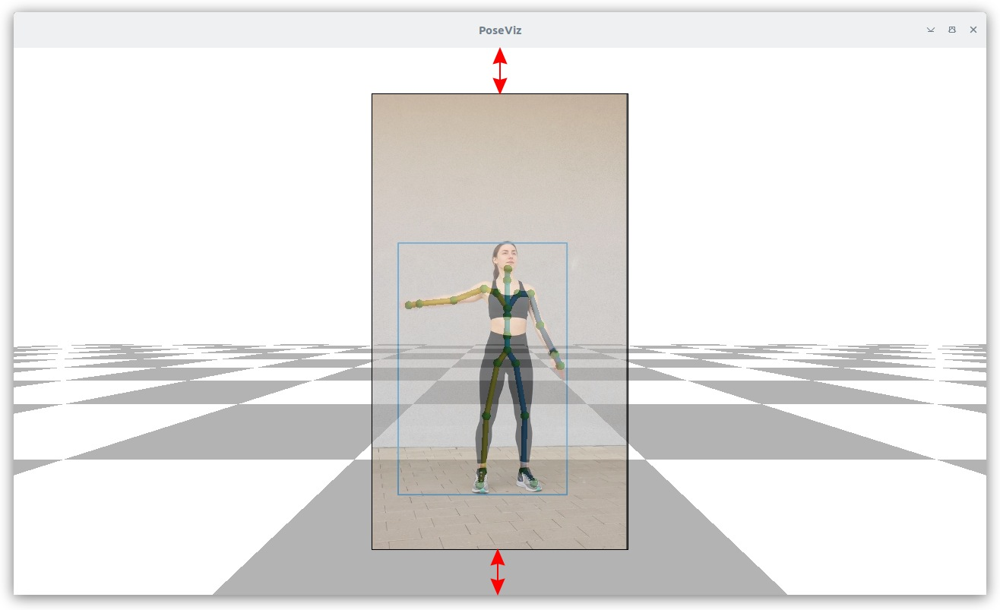

Usage Tips
==========

This page covers practical aspects of using PoseViz effectively.

Camera view padding
-------------------

When viewing the scene from a displayed camera's position (``camera_type='original'``),
you often want to see slightly beyond the edges of the video frame. The
``camera_view_padding`` parameter controls how much extra space is shown around the
image.

The value is a fraction of the frame size. For example, ``camera_view_padding=0.2``
adds 20% of the frame dimensions as padding on each side.

   ``camera_view_padding=0``: The view exactly matches the camera's field of view.
   The image fills the entire window.

   ``camera_view_padding=0.2``: Extra space around the image lets you see the
   skeleton even when extending beyond the frame edges.

The default is 0.2, which provides a good balance between seeing the full image
and having context around it.

Keyboard controls
-----------------

Navigation and playback:

- **x**: Pause/resume playback
- **c**: Step one frame forward (when paused)
- **z**: Toggle between original camera view and free-fly mode

Camera selection:

- **1-9**: Jump to camera 1-9 (snaps view to follow that camera)
- **n**: Cycle through cameras as the main view
- **d/g**: Snap to nearest camera (g also shows only that camera's poses)
- **t**: Toggle showing poses from all cameras vs. single camera
- **m**: Cycle which camera's poses are displayed

Free-fly navigation:

- **Left drag**: Orbit around pivot point
- **Shift + left drag**: Look around from current position (camera stays fixed,
  view direction rotates)
- **Middle drag**: Pan (move pivot)
- **Right drag / scroll**: Zoom (change distance)
- **Arrow keys**: Fly forward/back/left/right
- **Page Up/Down**: Fly up/down
- **+/-**: Adjust field of view

View modes:

- **Tab**: Toggle split-screen (see below)
- **F11**: Toggle fullscreen

History:

- **Mouse button 4/5**: Navigate back/forward through camera positions

Split-screen mode
-----------------

Press **Tab** to toggle split-screen mode. The window splits into two panes:

- **Left pane**: The original camera view — locked to the currently selected
  displayed camera. It follows the camera as it moves through the sequence,
  just like the normal original-camera mode.

- **Right pane**: A free-fly camera view — fully interactive. Orbit, pan, zoom,
  and fly around the scene independently of the displayed camera.

This is useful for examining the scene from a custom angle while still seeing
exactly what the camera sees. For example, you can keep the left pane showing
the input video perspective while orbiting around the subject in the right pane.

Mouse and keyboard input for camera control (dragging, scrolling, arrow keys)
only affects the right pane. The left pane is non-interactive — it always shows
the original camera's viewpoint. Clicking in the left pane has no effect on
camera navigation.

If the free-fly camera hasn't been initialized yet when you press Tab, it
automatically initializes from the current displayed camera's position.

